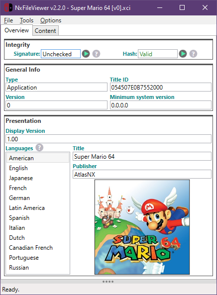
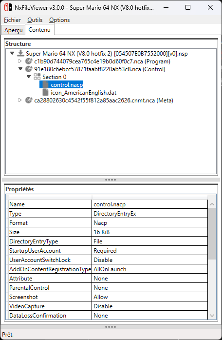
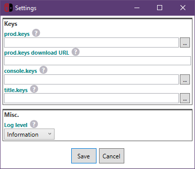

# NxFileViewer

## Description
View and browse content of Nintendo Switch files.

Download latest version [here](https://github.com/Myster-Tee/NxFileViewer/releases).

## Features
- Based on [LibHac](https://github.com/Thealexbarney/LibHac)
- Supported files: NSP, NSZ, XCI, XCZ
- Supports Super NSP/XCI
- Browse files content structure
- Export files
- Save or copy title images
- Specify your own keys location
- Searches keys in commonly used locations
- Automatically download keys from an URL defined in the settings
- Supports drag and drop
- Checks real files type (XCI or NSP)
- Detailed log
- User-friendly and responsive interface
- Single executable file
- Do not write anything outside of the program directory
- Verify hash and signature
- Displays missing keys
- Opens title URL
- Multiple languages (actually English and French, PR me for more ;))

## Screenshots







## Requirements

The program requires the *.NET Desktop Runtime 5 X64* which can be downloaded from the official Microsoft website [here](https://dotnet.microsoft.com/download/dotnet/5.0).

## Contribute
Feel free to contribute to this project to make this program better.

I designed the application so that it can easily be localized in several languages.
If you'd like to have this app in your language, feel free to give me your translations ;).

## Credits

- Special thanks to [Thealexbarney](https://github.com/Thealexbarney) for his powerful and easy to use [LibHac](https://github.com/Thealexbarney/LibHac) library.
- Thanks to all the Switch scene :)

## Building the solution

Use Microsoft Visual Studio 2019+ to build the solution.

By default, the assembly is signed using my personal certificate bundled in «AppSign.pfx».  
If you are not a team member, simply remove the signing certificate from the project properties.  
If you are a team member, you can install it (required once) from the Visual Studio Terminal window (CTRL+ù), by running the command below.

```
sn.exe -i .\NxFileViewer\AppSign.pfx <key_container_name>
```

***NOTE:** <key_container_name> can be obtained in the error message of the build output, in the form of «VS_KEY_XXXXXXXXXXXXXXXX».*

