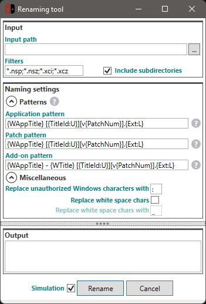

# NxFileViewer

## Description

View and browse content of Nintendo Switch files.

Download latest version [here](https://github.com/Myster-Tee/NxFileViewer/releases).

## Features

- Based on [LibHac](https://github.com/Thealexbarney/LibHac)
- Supported files: NSP, NSZ, XCI, XCZ
- Supports Super NSP/XCI
- Browse files content structure
- Export files
- Save or copy title images
- Specify your own keys location
- Searches keys in commonly used locations
- Automatically download keys from an URL defined in the settings
- Supports drag and drop
- Checks real files type (XCI or NSP)
- Detailed log
- User-friendly and responsive interface
- Single executable file
- Do not write anything outside of the program directory
- Verify integrity (hash and signature)
- Displays missing keys
- Opens title URL
- Multiple languages (actually English and French, PR me for more ;))
- Advanced files renaming
- Full support of NSZ and XCZ files (compressed with [NSZ](https://github.com/nicoboss/nsz/) tool from **nicoboss**).

## Screenshots





## Requirements

If application doesn't start, please install the *.NET Desktop Runtime 8* which can be downloaded from the official Microsoft website [here](https://dotnet.microsoft.com/download/dotnet/8.0).

## Contribute

Feel free to contribute to this project to make this program better.

I designed the application so that it can be easily localized in several languages.  
If you want this app in your language, send me your translations ;).

## Development

### Requirements

 - Microsoft Visual Studio 2022+

### Publishing

Run the PowerShell script below.

```PowerShell
.\Publish.ps1
```

## Credits

- Special thanks to [Thealexbarney](https://github.com/Thealexbarney) for his powerful and easy to use [LibHac](https://github.com/Thealexbarney/LibHac) library.
- Special thanks to [nicoboss](https://github.com/nicoboss/) who took a lot of time to explain me the [NSZ](https://github.com/nicoboss/nsz) format and many other things.
- Thanks to all the Switch scene :)
